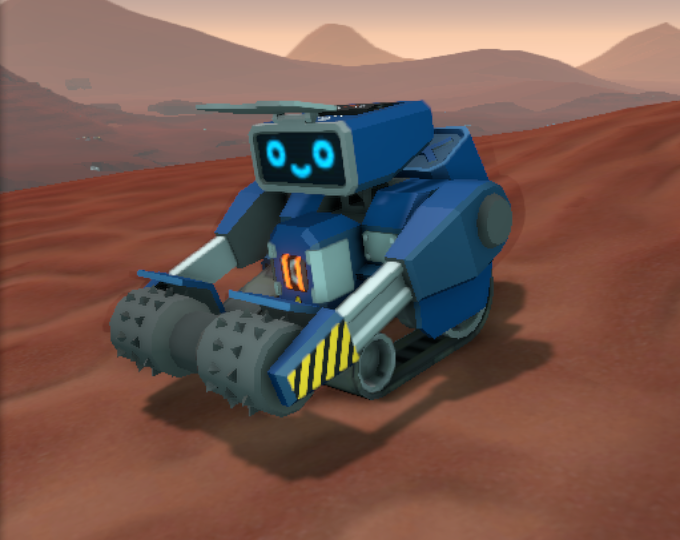
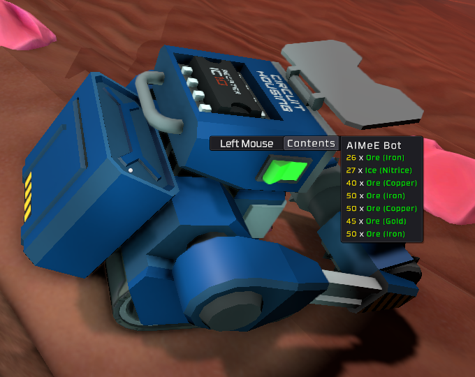
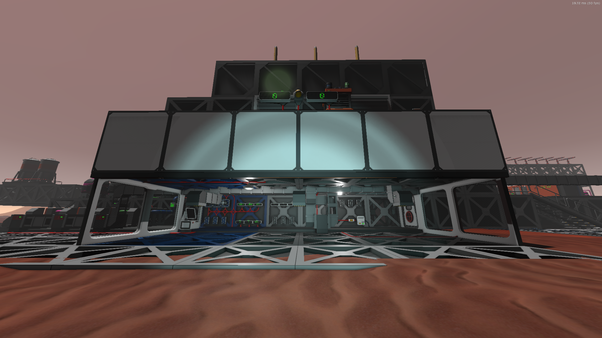
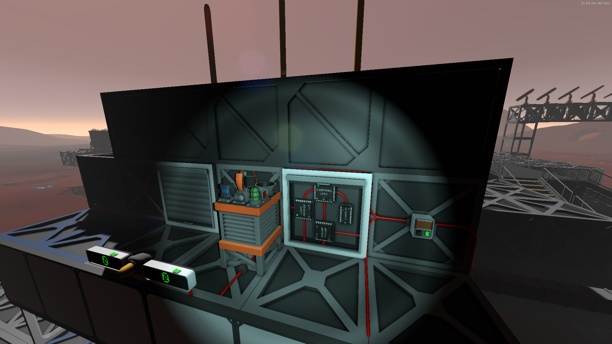
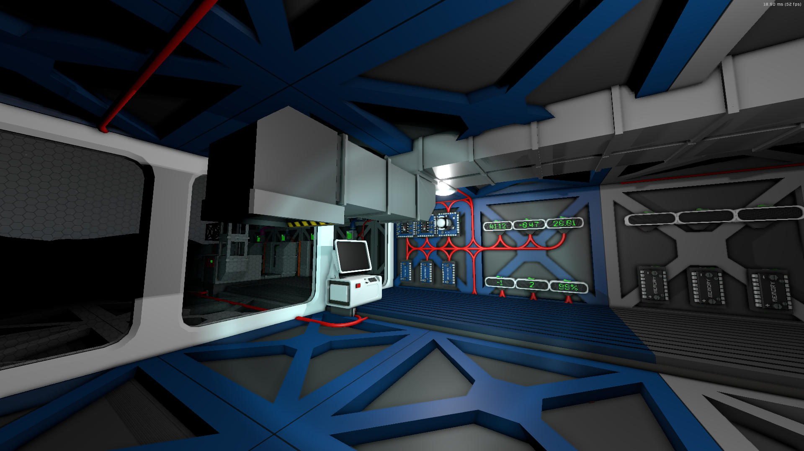
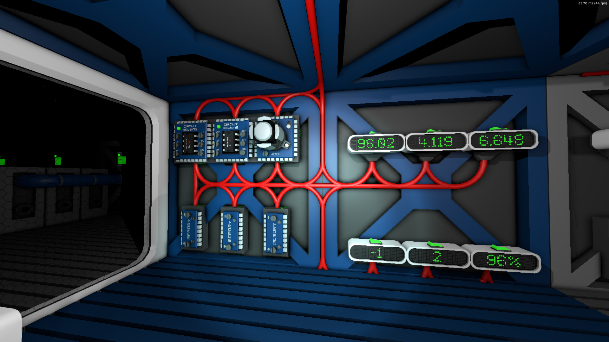

# AIMEeE

AIMeE is the cute little mining bot that roams acros the surface in order to gather ores and ices for you.  A very efficient way to gather resources.

The resources she gathers are stored in the container on her back, and can be a mix of Ores and Ices.

# What tools you will need

* A Labeller
* Wirecutters
* Cables
* A Tablet with the GPS cartridge
* Sensor Lenses with the Ore Scanner Sensor Unit

# What you are going to build

* At least one AIMeE Bot
* A Garage
    * A Station in the Garage for each AIMeE

## Garage

The first thing you're going to need is a Garage.  This is where AIMeE recharges her batteries, unloads Ores/Ices and shelters from storms.

The Garage is sub-divided into a number of Bays, so that each AIMeE has her own private space for contemplation.  I'm setting up 3 AIMeEs and dividing the Garage into 2x3 bays, this means I need a space that has a foot print of 6x3.

### Items

You need the following:
* Steel Frames + Steel Sheets
* Kit (Wall) + Plastic Sheets + Glass
* 1x Door
* 1x Kit (Power Transmitter Omni)
* 1x Computer
* 1x IC Editor Motherboard
* 1x Sorter Motherboard
* 1x Bay per AIMeE you want to operate (I use 3)
* 2x Small Hanger Door (per Bay)
* 1x Sorter

### Instructions

1. Build the floor from Steel Frames, based on the number of bays you want.  Mine is 6x3.
2. Build the back wall with Steel Frames so you can mount components.  The back is the narrow portion of the Bay, but is the longest wall of my Garage.
3. Build the side walls.  My preference is windows, and I also add a Manual Hatch using the Kit (Door) so I can get in/out during storms.
4. Create the ceiling form Steel Frames.
5. Weld all the Steel Frames so they are airtight.
6. Mount the Small Hanger Doors so that they drop down to cover the entrance.

## Weather Station

We're going to need to detect storms when they're coming in, and for that we'll mount a weather station on top of the garage.

### Items

* 1x Kit (Weather Station)
* 2x IC Housing
* 2x Integrated Chips (IC10)
* 2x Kit (Door)

### Instructions

1. Mount the Kit Door as a rolling shutter
2. Mount the IC Housing
3. Export [aimee_weather_alert.mips](./aimee_weather_alert.mips) to one Housing
4. Export [aimee_weather_alert.mips](./aime_doors.mips) to the other Housing

## AIMeE Bot

The star of the show is the cute AIMeE Bot.  You can run multiple bots at any one time, but to do so you'll need to build a larger garage.  Each AIMeE you want to operate will need her own Station (see below) to allow her to recharge, unload resources and shelter from the storms.

### Items

* 1x Kit (AIMeE)
* 1x Integrated Circuit (IC10)
* 1x Battery Wireless Cell (Big)

### Instructions

1. Deplay AIMeE next to the Power Transmitter Omni
2. Add the Blank IC10 chip into her head
3. Add the empty Wireless Battery into her chest
4. Leave her to charge.

## AIMeE Bay

I arrange a space that is 2x3 frames wide.  This leaves me 2 walls at the back to mount all the electronics, and a 2x2 area for AIMeE to recharge, unload and shelter.

Each bay has 2 Small Hanger Doors at the bottom, which will close during storms.

### Items

* 1x Logic Transmitter
* 3x Logic Memory
* 2x Kit (IC Housing)
* 2x Integrated Circuit (IC10)
* 6x Kit (Consoles)
* 2x Small Hanger Doors

### Instructions

First thing we need to do is mount the parts to build the following setup.

1. Mount the Logic Transmitter
2. Mount the Logic Memory as shown, and using the Labeller name them:
    * A Target X
    * A Target Y
    * A Target Z
2. Mount the Kit (Consoles) as LED Display (Small) and using the Labeller name them as follows:
    * A Display X
    * A Display Y
    * A Display Z
    * A Display Command
    * A Display Mode
    * A Display Power
3. Mount the IC Housing and use the Labeller to name them as follows:
    * A Display
    * A Controller
4. Add an Integrated Chip (IC10) to each housing
5. Configure the Logic Transmitter
    * Set it to Passive Mode
    * Using a screwdriver change the Unit to be you AIMeE bot.  If the screw is disabled, then that means the Transmitter is in Active mode.  Rather confusingly it shows "Set Active" in Passive Mode and "Set Passive" in active mode.  It makes sense when you think for a moment, but I found it confusing.
6. Configure the Display Circuit:
    1. Using the Computer Export [aimee_display.mips](./aimee_display.mips) to "A Display"
    2. Using a screwdriver set the control pins:
        * d0 => A Transmitter
7. Configure the Controller Circuit:
    1. Using the Computer Export [aimee_controller.mips](./aimee_controller.mips) to "A Controller"
    2. Using a screwdriver set the control pins:
        * d0 => A Transmitter
        * d1 => Weather Station
        * d2 => (none) 
        * d3 => A Target X
        * d4 => A Target Y
        * d5 => A Target Z

And you're done.  You're nearly ready to use AIMeE.

### Code

* [Display Circuits](./aimee_display.mips)
* [Controller Circuits](./aimee_controller.mips)
